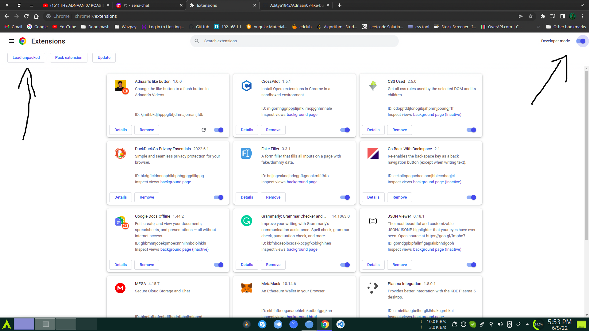

# This is only for Joke

Thugesh make a rost video on adanna07
in that video thugesh made a joke on adanna07 saying on adanna07 video replace like button with flush button

here 👇

https://youtu.be/HShNOPCWfBs?t=518

so i made a chrome extension called adanna's like button that will replace like button with flush button in adanna07's youtube videos

# How to use it

step 1:
Download the project

step 2:
open chrome and go to chrome://extensions

step 3:
turn on the developer mode
and click on load unpacked extension
and select the folder that you downloaded in step 1

<!-- add image from ss folder  -->

That's all!

# Demo 👇

